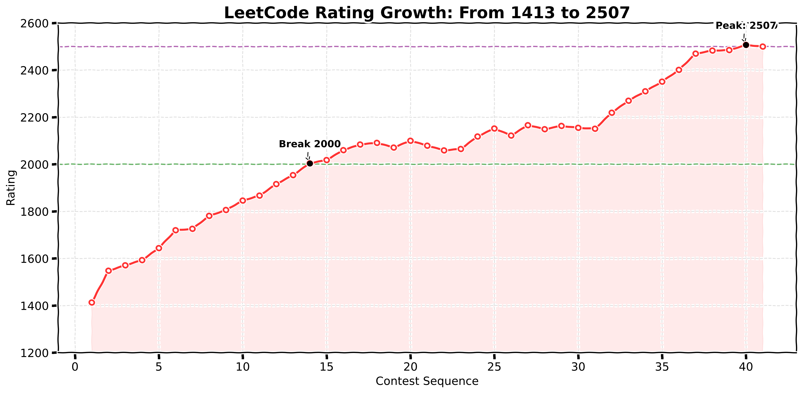

<h1 align="center">你好，我是 曹子颖 👋</h1>

<h3 align="center">算法工程师 | AI/RAG 开发者 | 算法竞赛爱好者</h3>

  

  
  
  
  <!--  -->
  

---

### 🎓 教育背景

- **中南大学 (985, 双一流)** | 硕士，电子信息（计算机学院） | 2024 - 2027
- **合肥工业大学 (211, 双一流)** | 本科，计算机科学与技术 | 2020 - 2024
  - **荣誉：** 国家奖学金 (连续2年 1.18%)、一等奖学金 (连续3年 1.21%)、华为智能基座奖学金（2.4%）、安徽省优秀毕业生（0.84%）。

---

### 🛠️ 核心技术栈

- **编程语言:** 熟练掌握 `C/C++`、`Python`、`Java`，具备扎实的编程基础与算法能力。
- **AI 与大模型应用:** `PyTorch`, `LangGraph`, `RAG` (LightRAG/Milvus), LLM Agent 架构。
- **后端与云原生:** `FastAPI`, `Docker`, `Docker Compose`, `Spring`, `Spring Boot`, `Redis`, 消息队列中间件等。
- **研发协作:** `Git/GitHub` 团队协作开发。

---

### 💼 实习与核心项目

#### 🏢 爱尔眼科医院集团（数字研究所） | 算法工程师
*2025 - 2026*
- 项目描述: 参与研发基于 LangGraph 的“CV+Agent”干眼症辅助诊断系统，主导视觉感知节点的开发，将复杂影像处理链路封装为 Agent 可调用的标准工具 (Tools)，打通视觉感知到逻辑推理的数据流。
- 核心产出: 针对睑板腺形态，训练并部署多任务视觉模型 (ResNet+U-Net) 完成腺体缺失与弯曲度量化 **(Dice 达 81%)**；设计多模态数据解析逻辑，将量化指标转化为标准化的状态 (State) 注入 Agent 记忆流，为下游的自动化诊断推断提供高置信度事实依据。

#### 💻 RagMemorySys (多租户对话记忆 RAG 微服务)
*2025 - 2026*
- 设计并实现对话记忆微服务，支持多用户隔离及标准化上下文拼接。构建了“基础记忆+向量记忆”双层架构，实现高效的文本分块与 Top-k 语义召回。
- 基于 LoCoMo 数据集独立完成端到端评测 (LLM-as-a-Judge)，将系统失败率 **控制在 3.02%**，优化检索阶段平均延迟至 **262.7ms**。

#### 🔬 药物靶标相互作用预测研究 (DTI/DTA/MOA/Koff)
*2025 - 2026*
- 创新设计基于混合专家模型 (MoE) 与双向交叉注意力的深度网络架构。
- 模型整体性能达到 **SOTA**，攻克了极具挑战的极端冷启动 (Zero-shot) 泛化难题，将分布外场景的预测均方误差 (MSE) **显著降低 35.5%**，端到端训练提速近 17 倍。

---

### 🏆 荣誉与竞赛

#### 🥇 国家级荣誉
- **国家奖学金** (2020-2022 学年度，连续两年荣获)
- 第十六届 **蓝桥杯** 大赛软件赛国赛 C++程序设计 (研究生组) - **全国二等奖**
- 第二十一届 **“华为杯”** 中国研究生数学建模竞赛 - **全国二等奖**
- 第十三届 **全国大学生数学竞赛** (非数学类) - **全国二等奖**

#### 🥈 省部级荣誉
- 首届 **中国计算机学会算法能力大赛 (CACC)** - **二等奖**
- 第二十届 **百度之星** 程序设计大赛 - **省银奖**
- 第八届 安徽省 **“互联网+”** 大学生创新创业大赛 (高教主赛道) - **银奖**
- 2023年 安徽省机器人大赛单片机与嵌入式系统赛道 (E平台) - **三等奖**
- 2022年 全国大学生信息安全竞赛安徽省赛网络攻防赛道 (本科组) - **三等奖**

#### 🥉 校级竞赛与综合荣誉
- **程序设计类：** 合肥工业大学第九届 ACM 程序设计大赛 **一等奖**、宣城校区程序设计竞赛暨安徽省选拔赛 **一等奖**。
- **数理类：** 合肥工业大学宣城校区第七届大学生数学竞赛 **一等奖**。
- **综合表彰：** 本科期间连续三年荣获校级 **一等奖学金**、**优秀三好学生** / **三好学生** 及 **优秀共青团员** 称号。

---

### 📊 算法与开源态势

  
  

 

  

 

  

